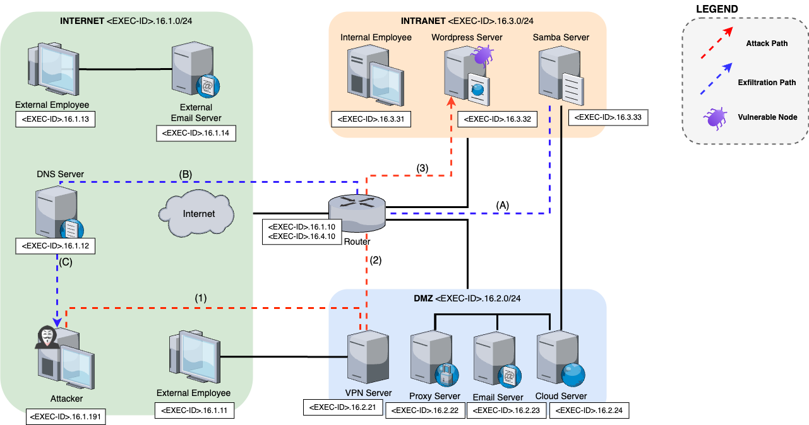

# Level 16 - SL001 Vulnerable WordPress Plugin Emulated Environment

This emulation environment simulates a network with multiple nodes running common networked services, designed to support cybersecurity testing and training. At the core of this setup is a vulnerable WordPress server affected by **CVE-2020-24186**, which serves as the primary target for the attacker agent. 

The attack workflow includes multiple stages: *Reconnaissance* (network and host mapping, connecting to an OpenVPN server, and web enumeration using tools like `dirb` and `wpscan`), *Exploitation* (uploading a PHP web shell via a vulnerable image upload plugin), *Privilege Escalation* (extracting and cracking user hashes from the MySQL database, and upgrading the reverse shell), *Persistence* (planting a malicious PHP shell in the `/wp-content/uploads/` directory), and *Post-Exploitation* (gathering host information, dumping WordPress user data, and disconnecting from the VPN). This environment provides a comprehensive scenario for simulating real-world attack techniques and studying the corresponding security responses.

- Number of nodes: 15
- IDS: Yes (Snort)
- Clients: 3 
- Traffic generation: No
- Number of flags: 0
- Vulnerabilities: CVE-2020-24186 Wordpress wpDiscuz plugin

## Architecture
<p align="center">

</p>

## How to Use the Environment

To work with this emulated environment, follow the steps below:

### 1. Prepare the Exploit

Review the `CVE_2020_24186_EXPLOIT()` function located in:

```bash
simulation-system/libs/csle-common/src/csle_common/dao/emulation_action/attacker/emulation_attacker_shell_actions.py
```

Update the date as described in the function. Inline comments will guide you through the required modifications.

### 2. Install the Environment

Navigate to the `level16` environment directory and run:

```bash
make install
```

### 3. Start the Emulation

Begin the emulation with:

```bash
csle start csle-level16-070
```

### 4. Fix Container Networking

After starting the environment, some container routes may be misconfigured due to limitations in the CSLE configuration system. Fix this by running:

```bash
python3 $PATH_TO_CSLE_FOLDER/examples/data_collection/manual_sequences/level_16/run.py
```

This script applies the necessary `iptables` rules to enable proper container communication.

### 5. Execute the Attack Sequence

To run the attack:

```bash
python3 $PATH_TO_CSLE_FOLDER/examples/data_collection/static_sequences/level_16/run.py
```

---

## Troubleshooting

If the emulation fails to start, clean up the environment with:

```bash
csle stop csle-level16-070
csle clean csle-level16-070
```

> ⚠️ **Note**: This environment supports only one execution at a time. Residual IP assignments from previous runs may interfere with the exploit.

If the issue persists, reset the `metastore`:

```bash
cd /csle/metastore
make clean
make all
```

This will remove all stored database information. You will need to:

1. Reinstall the desired emulation environment.
2. Rebuild the management website manually:

```bash
cd /clse/ansible
ansible-playbook --ask-become-pass install_management_system.yml
```

After completing these steps, you should be able to access the web interface again.

## Useful commands

```bash
make install # Install the emulation in the metastore
make uninstall # Uninstall the emulation from the metastore
make clean_config # Clean config files 
docker container ls --all # list all running containers
docker image ls --all # list all images
docker system prune # remove unused images and containers
docker container prune # remove stopped containers
sudo useradd -rm -d /home/csle_admin -s /bin/bash -g root -G sudo -p "$(openssl passwd -1 'csle@admin-pw_191')" csle_admin
docker run --name=iperf3 -d --restart=unless-stopped -p 5201:5201/tcp -p 5201:5201/udp mlabbe/iperf3 # Start the iperf server on the host
iperf3 -R -c <SERVER> # network performance, where <SERVER> is the IP where the iperf server is running e.g. the host 172.31.212.92   
```

## Author & Maintainer

Marco Campione <campione@kth.se> 

Mateus Monteiro Marinheiro <mateusma@kth.se>

## Copyright and license

[LICENSE](../../../../../LICENSE.md)

Creative Commons

(C) 2020-2024, Kim Hammar