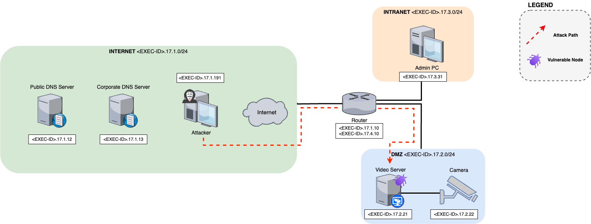

# Level 17 - SL700 Vulnerable ZoneMinder VideoServer Emulated Environment 

This emulation environment replicates a networked setup containing nodes that simulate real-world services, with a vulnerable video server running ZoneMinder affected by **CVE-2023-26035** — an unauthenticated remote code execution vulnerability due to missing authorization checks.

The attacker agent operates through a staged intrusion process: *Reconnaissance* (using tools like `dns-brute`, `nmap`, `nikto`, and `ffuf` for network and web enumeration), *Exploitation* (leveraging the RCE vulnerability to execute arbitrary commands remotely), *Privilege Escalation* (uploading `linpeas` to identify local misconfigurations, discovering a root SSH key, and using it to gain root access), *Persistence* (adding an attacker-controlled SSH key to authorized_keys), and *Post-Exploitation* (conducting comprehensive host profiling via commands like uname, ifconfig, netstat, ps, df, and uptime). This environment provides a comprehensive scenario for simulating real-world attack techniques and studying the corresponding security responses.


- Number of nodes: 9
- IDS: Yes (Snort)
- Clients: 0 
- Traffic generation: No
- Number of flags: 0
- Vulnerabilities: CVE-2023-26035 Zoneminder Unauthenticated RCE via Missing Authorization

## Architecture
<p align="center">

</p>

## How to Use the Environment

To work with this emulated environment, follow the steps below:

### 1. Install the Environment

Navigate to the `level17` environment directory and run:

```bash
make install
```

### 2. Start the Emulation

Begin the emulation with:

```bash
csle start csle-level17-070
```

### 3. Fix Container Configuration

After starting the environment, some containers are not fully configured due to limitations in the CSLE configuration system. Fix this by running:

```bash
python3 $PATH_TO_CSLE_FOLDER/examples/data_collection/manual_sequences/level_17/run.py
```

This script applies the necessary configurations in order to propely run the attacker steps.

### 4. Execute the Attack Sequence

To run the attack:

```bash
python3 $PATH_TO_CSLE_FOLDER/examples/data_collection/static_sequences/level_17/run.py
```

---

## Troubleshooting

If the emulation fails to start, clean up the environment with:

```bash
csle stop csle-level17-070
csle clean csle-level17-070
```

> ⚠️ **Note**: This environment supports only one execution at a time. Residual IP assignments from previous runs may interfere with the exploit.

If the issue persists, reset the `metastore`:

```bash
cd /csle/metastore
make clean
make all
```

This will remove all stored database information. You will need to:

1. Reinstall the desired emulation environment.
2. Rebuild the management website manually:

```bash
cd /clse/ansible
ansible-playbook --ask-become-pass install_management_system.yml
```

After completing these steps, you should be able to access the web interface again.

There could be an error when running the attacker steps related to the python library BeautifulSoup4. In the installation process, sometimes this library is not installed properly and needs to be installed manually. For this execute the following command with the id of the hacker kali container for level 17:

```bash
docker exec -it <containter-id> pip3 install bs4
```

## Useful commands

```bash
make install # Install the emulation in the metastore
make uninstall # Uninstall the emulation from the metastore
make clean_config # Clean config files 
docker container ls --all # list all running containers
docker image ls --all # list all images
docker system prune # remove unused images and containers
docker container prune # remove stopped containers
sudo useradd -rm -d /home/csle_admin -s /bin/bash -g root -G sudo -p "$(openssl passwd -1 'csle@admin-pw_191')" csle_admin
docker run --name=iperf3 -d --restart=unless-stopped -p 5201:5201/tcp -p 5201:5201/udp mlabbe/iperf3 # Start the iperf server on the host
iperf3 -R -c <SERVER> # network performance, where <SERVER> is the IP where the iperf server is running e.g. the host 172.31.212.92   
```

## Author & Maintainer

Marco Campione <campione@kth.se> 

Mateus Monteiro Marinheiro <mateusma@kth.se>

## Copyright and license

[LICENSE](../../../../../LICENSE.md)

Creative Commons

(C) 2020-2024, Kim Hammar